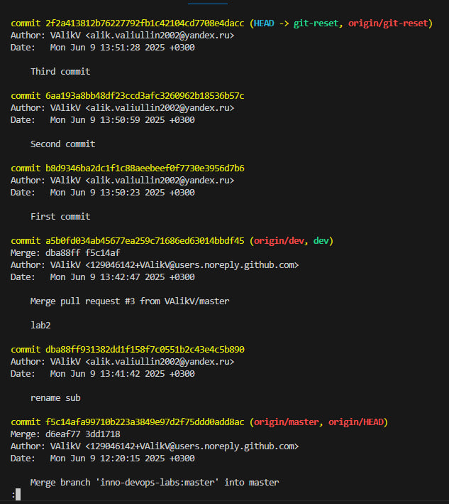

## Task 1: Understanding Version Control Systems

### To get commit hashes
```bash
git log --oneline
```
### Output

```bash
c59e1aa (HEAD -> dev, origin/dev) add sub3
eec89c5 add image
d26f7a7 1st lab complete
0fea98c (origin/master, origin/HEAD, master) lab2 Git
a107866 lab1 Intro
```

#### Last commit hash - c59e1aa

### git cat-file -p <commit_hash>

```bash 
git cat-file c59e1aa
```

### Output

```bash
parent eec89c5fdba9daf150146984cb3a4aadcd01409e
author VAlikV <alik.valiullin2002@yandex.ru> 1749456552 +0300
committer VAlikV <alik.valiullin2002@yandex.ru> 1749456552 +0300
gpgsig -----BEGIN SSH SIGNATURE-----
 U1NIU0lHAAAAAQAAADMAAAALc3NoLWVkMjU1MTkAAAAgLGt9c/gecg3WlEwQvytg9pYXg+
 sevCwrAFl+GGA40RkAAAADZ2l0AAAAAAAAAAZzaGE1MTIAAABTAAAAC3NzaC1lZDI1NTE5
 pQO+L8vlWe3Fb19AGVhwE=
 -----END SSH SIGNATURE-----
```

#### Tree hash - eec89c5fdba9daf150146984cb3a4aadcd01409e

### git cat-file -p <tree_hash>

```bash
git cat-file -p af81ff3f7823bb5fdebe30e210d886976f25c8c2
```

### Output

```bash
100644 blob af7fda8ea32b60578a1103ce061a50d7f6f09a35    README.md
100644 blob d80712d62eff749c52a5b9c86e31d2073355a429    image.png
100644 blob 7a94f7af59b8968be392288ea03179a24ffc9d9e    lab1.md
100644 blob 2f8463cc188ec6ca69ae7a0f98d38e132280becb    lab2.md
100644 blob b284e8d1e2ba53f5d5ca9f8798a808e94bb47ef2    submission1.md
100644 blob 8b137891791fe96927ad78e64b0aad7bded08bdc    submission3.md
```

#### F.e. file README.md hash - af7fda8ea32b60578a1103ce061a50d7f6f09a35

### git cat-file -p <blob_hash>

```bash
git cat-file -p af7fda8ea32b60578a1103ce061a50d7f6f09a35
```

### Output

#### *File content*

## Task 2: Practice with Git Reset Command

### Created 3 commits

```bash
echo "First commit" > file.txt
git add file.txt
git commit -m "First commit"

echo "Second commit" >> file.txt
git add file.txt
git commit -m "Second commit"

echo "Third commit" >> file.txt
git add file.txt
git commit -m "Third commit"
```

### Reset

```bash
git reset --soft HEAD~1
git reset --hard HEAD~1
```

#### --soft - deletes commit but does not roll back the changes
#### --hard - deletes commit and roll back the changes


```bash
git reset --soft HEAD~1 # roll back to Second commit
git reset --soft HEAD~1 # roll back to First commit
git reset --hard HEAD~1 # roll back to original state
```

#### HEAD~1 means a rollback of 1 commit below the last one

### Output
```bash
HEAD is now at a5b0fd0 Merge pull request #3 from VAlikV/master
```

#### The first two reset did not change file.txt, and the last one deleted it, since it was not in original state.

### To return to the last commit again, you can use 

```bash
git reflog
git reset --hard <reflog_hash>
```

#### reflog - reference logs for the Git repository. It contains records of all pointer movements in the repository, such as branches and commits, even if these movements are not visible in the normal commit history.

### reflog output

```bash
a5b0fd0 (HEAD -> git-reset, origin/dev, dev) HEAD@{0}: reset: moving to HEAD~1
b8d9346 HEAD@{1}: reset: moving to HEAD~1
6aa193a HEAD@{2}: reset: moving to HEAD~1
2f2a413 (origin/git-reset) HEAD@{3}: commit: Third commit
6aa193a HEAD@{4}: commit: Second commit
b8d9346 HEAD@{5}: commit: First commit
a5b0fd0 (HEAD -> git-reset, origin/dev, dev) HEAD@{6}: checkout: moving from dev to git-reset
a5b0fd0 (HEAD -> git-reset, origin/dev, dev) HEAD@{7}: pull --tags origin dev: Fast-forward
dba88ff HEAD@{8}: commit: rename sub
9c815ae HEAD@{9}: pull --tags origin dev: Fast-forward
eec89c5 HEAD@{10}: checkout: moving from dev to dev
eec89c5 HEAD@{11}: reset: moving to HEAD~1
```

### To roll back to the desired commite, select reflog_hash.

```bash
git reset --hard 2f2a413
```

### Output

```bash 
HEAD is now at 2f2a413 Third commit
```

### Reflog output


### Gitlog output
